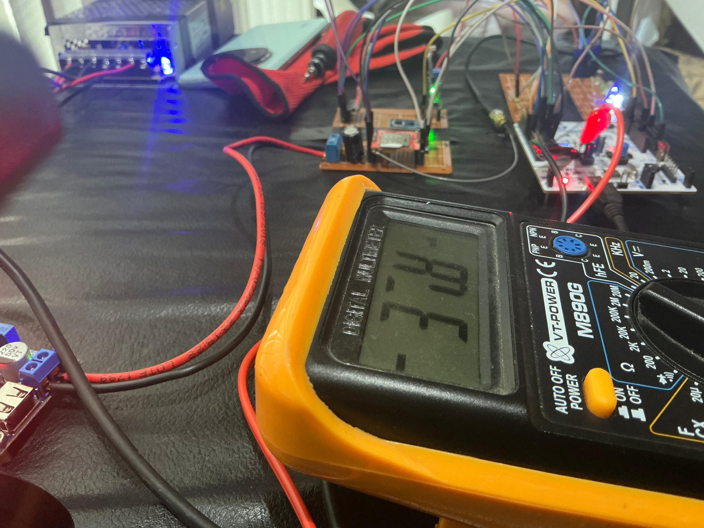
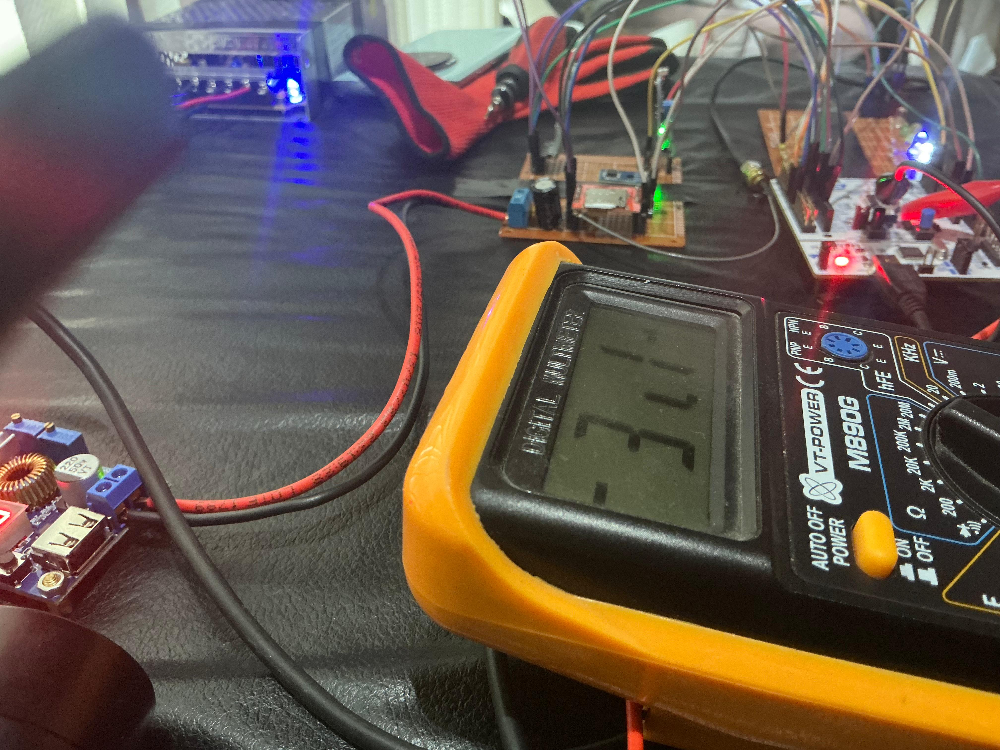
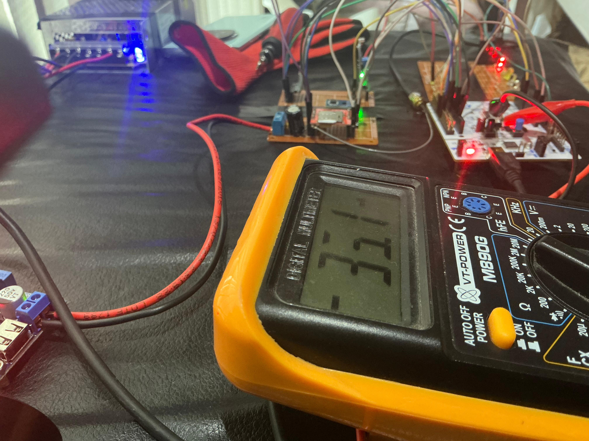
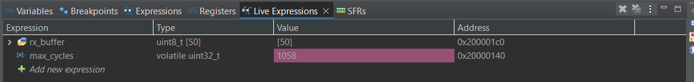
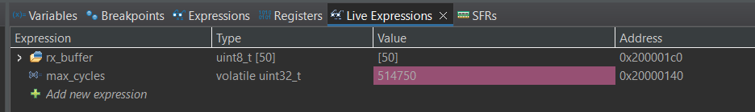
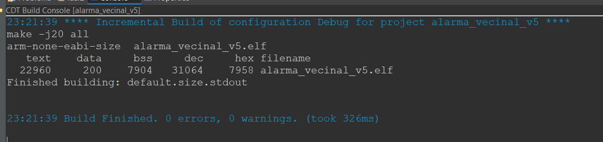
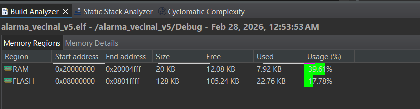
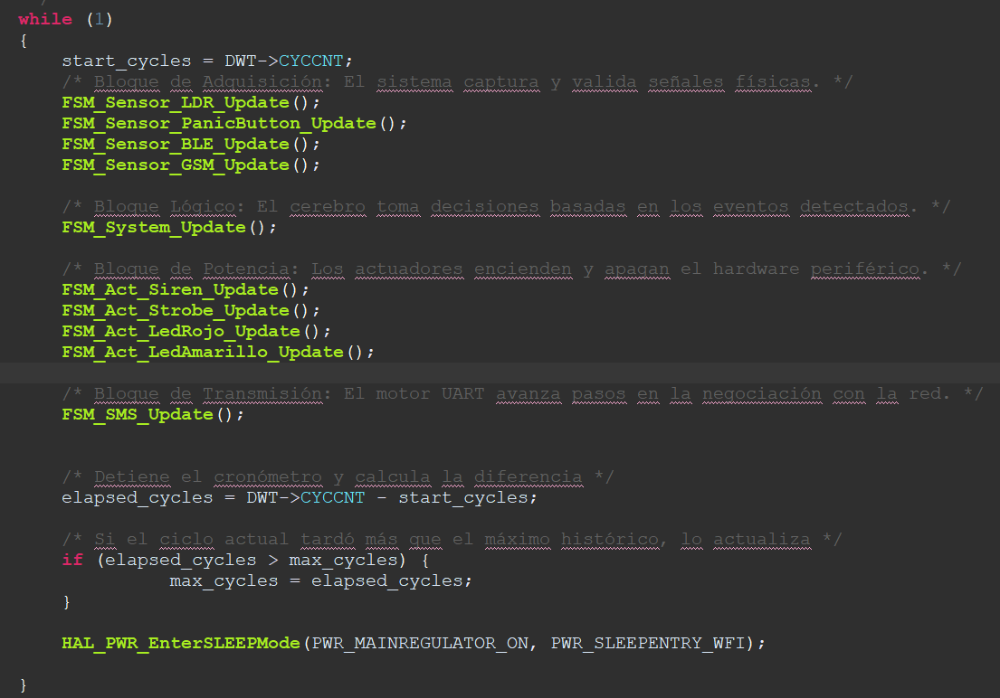

# Análisis de Ejecución y Consumo Energético - Sistema de Alarma Vecinal

El presente documento detalla las métricas de rendimiento y el perfil de consumo eléctrico del sistema. La evaluación responde 
a los requerimientos técnicos de la arquitectura de hardware y software del proyecto.

## 1. Medición y análisis de consumo

Las pruebas de consumo de corriente sobre la placa NUCLEO-F103RB arrojaron los siguientes resultados. 
El entorno de prueba mantuvo el módulo Bluetooth (BLE) conectado al stm a 5V permanente durante todas las mediciones.

* **Consumo sobre la línea de 5 V (Sistema general):**
    * Estado de reposo: **36.1 mA**
    * Estado activo: **37.8 mA**
    * *Evidencia 1:*
<div align="center">
  
</div>
<div align="center">
  
</div>

* **Consumo sobre la línea de 3.3 V (Microcontrolador STM32):**
    * Estado de reposo: **31.1 mA**
    * Estado activo: **33.1 mA**
    * *Evidencia 2:*
 
<div align="center">
  
</div>

<div align="center">
  
</div>

### Análisis del módulo GSM (SIM800L)
Como secarece de un osciloscopio. Por este motivo, el reporte omite la medición 
de los picos transitorios de consumo del módulo GSM SIM800L. 

Para un registro preciso de la energía de este componente, el procedimiento teórico sería 
la instalación de una resistencia  de bajo valor (por ejemplo, 0.1 ohmios) en serie con 
la alimentación positiva (VCC) del módulo. Un osciloscopio, con sus sondas en paralelo a la resistencia, 
se debería capturar la caída de tensión máxima originada por la ráfaga de transmisión de un SMS o llamda entrante. 
De esta forma el cálculo de la corriente pico real 
surge de la división de este voltaje máximo por el valor resistivo, por la Ley de Ohm.

## 2. Medición y análisis de tiempos de ejecución de cada tarea (WCET)

Para la evaluación temporal del *Worst Case Execution Time* (WCET) el análisis se aplica con el registro interno DWT del microcontrolador a 72 MHz para registrar los ciclos de reloj exactos del sistema.

* *Evidencia 3 (Tiempo en Reposo):*
<div align="center">
  
</div>


* *Evidencia 4 (Tiempo en Estrés - WCET):*
<div align="center">
  
</div>

**Análisis Matemático y Conversión Temporal:**
La arquitectura del microcontrolador opera a una frecuencia fija de 72 MHz. Esta velocidad de 
procesamiento equivale a 72.000 ciclos de reloj por cada milisegundo (o 72 ciclos por cada microsegundo). 

Para determinar el tiempo real de ejecución, se hace la división del número de ciclos capturados
en la herramienta de depuración por este factor de conversión de la CPU.
* **Cálculo del sistema en estado de reposo (Evidencia 3):**
$$Tiempo_{reposo} = \frac{1058 \text{ ciclos}}{72 \text{ ciclos/µs}} = 14.69 \text{ µs}$$
* **Cálculo del sistema en estado de estrés (Evidencia 4):**
$$WCET = \frac{514750 \text{ ciclos}}{72000 \text{ ciclos/ms}} = 7.15 \text{ ms}$$


* Tiempo máximo de ejecución registrado (WCET): **7.15 milisegundos**.
* Condiciones de la prueba de estrés: **El sistema procesó la activación de la alarma por botón
  físico y por llamada y la más exigente fue la llamada, se completó con el envío de los mensajes y conexiones BLE y comandos de altas y bajas.**


## 3. Captura de pantalla de "Console & Build Analyzer"

El reporte de uso de memoria tras la compilación de la versión final del código fuente expone la distribución de recursos en la memoria FLASH y RAM.

* *Evidencia 4: Console*
<div align="center">
  
</div>

* *Evidencia 5: Build Analyzer*
<div align="center">
  
</div>

## 4. Cálculo del Factor de Uso (U) de la CPU

Para la determinación del factor de carga del procesador se aplica la relación directa entre el tiempo de
ejecución en el peor de los casos y la duración total del ciclo del sistema.

**Fórmula aplicada:**
$$U = \frac{WCET}{T_{ciclo}} \times 100$$

**Desarrollo del cálculo:**
* WCET: **7.15 ms**

* Tiempo de ciclo total ($T_{ciclo}$): **8.15 ms** (7.15 ms de ejecución máxima + 1.0 ms de retardo programado por la interrupción base SysTick).

* Resultado Final ($U$): **87.73 %**

## 5. Gestión del modo de bajo consumo

El código fuente incorpora directrices específicas de administración de energía para optimizar el rendimiento térmico y eléctrico.

* **Modo seleccionado:** Sleep Mode (`HAL_PWR_EnterSLEEPMode`).

* **Justificación técnica:** El cálculo del factor de uso demuestra la inactividad de la unidad central de procesamiento la mayor parte del tiempo. El sistema demanda mantener operativas las interfaces UART para la recepción asíncrona de comandos desde los periféricos Bluetooth y GSM. El modo Sleep detiene el reloj del núcleo central, pero conserva los periféricos encendidos. El microcontrolador despierta automáticamente ante interrupciones de red o al completarse el ciclo del temporizador base.

* *Evidencia 6:*
<div align="center">
  
</div>

```c
      /* Bloque de Transmisión: El motor UART avanza pasos en la negociación con la red. */
      FSM_SMS_Update();

      /* Entra en Sleep Mode. La CPU se detiene ahorrando energía, pero los periféricos UART
         siguen activos. El sistema despierta automáticamente con la interrupción del
         SysTick (1ms) o cuando ingresa un dato por Bluetooth/GSM. */
      HAL_PWR_EnterSLEEPMode(PWR_MAINREGULATOR_ON, PWR_SLEEPENTRY_WFI);
  }
}
