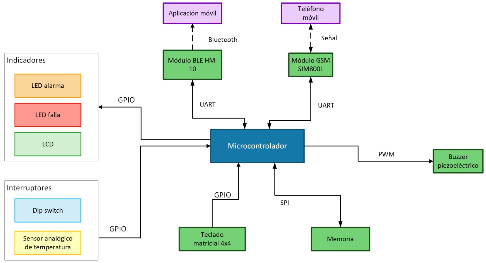

# Alarma vecinal

### Autores: Valentín Guirin, Carolina Gonzales Peralta, Yerson Michael Monzón Alayo
### Padrones: 107416, 110804, 104262

### Fecha: 2° cuatrimestre de 2025

## Selección del proyecto a implementar

### Contexto.

El proyecto a implementar tiene sus bases en la inseguridad que hoy en día está presente en la Ciudad de Buenos Aires. En particular, en las villas, donde la inseguridad es recurrente y forma parte del día a día. Dadas estas circunstancias, el cuidado entre vecinos residentes es crucial y creemos que la adquisición de una alarma vecinal como la que se propone en este informe es importante y sugiere que sería un producto potencialmente comercial.

Si bien ya existen este tipo de mecanismos, los vecinos tienden a organizarse de forma informal: grupos de mensajería, silbatos, bocinas caseras o campanas. Sin embargo, estos mecanismos suelen ser descoordinados, no escalables y dependen de que un vecino en particular esté atento, tenga crédito en el celular o pueda emitir un mensaje en el momento justo.

El presente trabajo final propone el diseño e implementación de un sistema de alarma vecinal basado en una plataforma de sistemas embebidos. El objetivo es que varios vecinos autorizados puedan activar de forma remota una sirena común mediante una llamada telefónica sin costo (llamada no contestada) o mediante un botón de pánico local, y que el sistema notifique el evento al resto de los usuarios, a la central y a la policía mediante SMS. La administración y configuración del sistema se realiza de forma remota y controlada a través de Bluetooth Low Energy (BLE) por personal autorizado enviado por la central.

### Objetivo del proyecto y resultados esperados

Se busca diseñar un nodo de alarma vecinal, instalado en la calle, que pueda ser activado de forma remota por vecinos autorizados sin costo por llamada, y también de forma local mediante un botón de pánico, y que a su vez:

-	Permita una administración remota de la configuración (números autorizados, coordenadas de instalación, contactos de policía/central) mediante una conexión Bluetooth con personal autorizado.

- Provea feedback al resto de los vecinos mediante SMS y un canal BLE hacia la central.

- Cumpla restricciones de bajo consumo, robustez y simplicidad de uso propias de un sistema embebido sin sistema operativo.

En términos técnicos, se busca materializar un sistema ciberfísico capaz de:
	- Escuchar eventos externos:
  - llamadas GSM entrantes,
  - pulsación del botón de pánico,
  - conexión y comandos del personal autorizado vía BLE,
	 - lectura del sensor lumínico para determinar día/noche.
 - Procesar mediante una máquina de estados bien definida (modo armado y desarmado, alta y baja de usuarios y configuración por Bluetooth).
 - Actuar sobre una sirena/buzzer, una luz estroboscópica, LEDs de estado y canales de comunicación (SMS / BLE) de forma determinista y medible.

### Descripción de alto nivel.

El sistema consiste en un nodo de alarma vecinal compuesto por los siguientes elementos principales:
	-	Placa NUCLEO-F103RB (STM32F103RB) como unidad de procesamiento central.
	-	Módulo GSM SIM800L para recepción de llamadas y envío de SMS.
	-	Módulo BLE HM-10 para vinculación con personal autorizado de la central mediante una app tipo “terminal BLE”.
	-	Botón de pánico montado en el gabinete de la alarma para activación manual local.
	-	Luz estroboscópica (accionada a través de un módulo de relé o etapa de potencia) para señalizar visualmente el estado de alarma, especialmente de noche.
	-	Buzzer/sirena para señalización sonora de la activación de la alarma.
	-	Conjunto de LEDs de estado, incluyendo al menos:
	 -	LED de sistema armado/encendido,
	 -	LED de autenticación correcta (vía BLE),
	 -	LED de autenticación incorrecta.
	-	Memoria no volátil (utilizando la Flash interna del STM32) para almacenar:
	 -	la lista de números telefónicos autorizados,
	 -	las coordenadas de la alarma,
	 -	las credenciales del personal autorizado,
	 -	los números de contacto de usuarios, policía y central.
	-	Sensor lumínico (LDR + divisor resistivo) conectado a un canal ADC para detectar luz de día/noche y adaptar el comportamiento visual de la alarma (uso de la luz estroboscópica).

 

### Descripción desde el punto de vista funcional.

- Recibe una llamada entrante en el SIM card de la alarma.
- Obtiene el número llamante (Caller ID) vía comandos AT y lo compara contra una lista
blanca.
- Si el número está autorizado, corta la llamada sin contestar (no se factura) y activa la
sirena durante un tiempo configurable.
- Opcionalmente, envía SMS de alerta a un conjunto de teléfonos predefinidos.
- Permite activar la sirena localmente mediante un botón de pánico en el teclado.
- Expone el estado del sistema por BLE (HM-10) para que los vecinos puedan consultar si la
alarma está armada/desarmada y cuáles fueron los últimos eventos.
- Permite que un administrador, mediante PIN, gestione la lista blanca y parámetros desde el
LCD/teclado.

### Alcance del MVP.

Para acotar el trabajo y cumplir con los plazos de la materia, se define un MVP con el
siguiente alcance:
- Soporte de hasta N números de teléfono en lista blanca.
- Un único nodo de alarma, instalado en una esquina o edificio.
- Activación de la sirena por:
 - llamada entrante autorizada,
 - botón de pánico local en el teclado.
- Notificación de evento vía:
 - SMS a al menos un número predefinido,
 - mensaje de texto por BLE (estado + último evento).
- Un único sensor analógico para diagnóstico (temperatura interna en caso de que la emergencia sea incendio).
- Al menos dos modos de operación implementados y demostrables: modo NORMAL, SET_UP y FALLA.

### Algunos componentes y funciones.

-Botones/Teclas: teclado matricial 4x4, tecla de pánico, navegación de menú
- LEDs: Alarma, falla
- Buzzer: feedback sonoto en cambios de estado, errores y pulsaciones
- Memoria no volátil: EEPROM I2C externa o Flash interna para lista blanca y parámetros
- Sensor analógico: LM35/NTC para diagnóstico térmico
- Dip switches: selección de perfil de funcionamiento y nodo
- HM-10: canal de monitoreo BLE para estado y último evento

### Componentes principales.

- NUCLEO-F103RB (STM32F103RB).
- Módulo GSM SIM800L con fuente regulada a ~4,0 V y capacidad de al menos 2 A.
- Módulo BLE HM-10 alimentado a 3,3 V.
- LCD 16x2 compatible HD44780 en modo 4 bits.
- Teclado matricial 4x4.
- Módulo de relé con aislamiento óptico para la sirena/luz.
- Buzzer piezoeléctrico 5 V.
- LEDs indicadores (mínimo 3: ARM, ALARM, FAIL).
- Sensor analógico (LM35/NTC).
- EEPROM I2C (opcional) o uso de Flash interna.
- Dip switches (al menos 2 bits de configuración).
- Fuente de alimentación con dos etapas de regulación

## Diagrama en bloques del sistema

## Elicitación de requisitos y casos de uso

En la Ciudad de Buenos Aires existe un competidor crucial en el mercado de la seguridad interconectada: [Verisure](https://www.verisure.com.ar/blog/alarma-barrial-que-es). Si bien es una marca de un gran calibre, consideramos que nuestro proyecto se enfoca en una zona particular y muy específica de la ciudad, dándonos la posibilidad de poder adaptar nuestro producto a las necesidades de la gente que allí resida y así poder consolidarnos en el mercado. Nuestra gran diferencia con
Verisure es que gran parte de nuestro trabajo será para reducir los costos al mínimo dado el público comprador. Evaluaremos en el transcurso del proyecto si
convendría vender al Gobierno de la Ciudad o directamente a los residentes, pero concluimos que esta cuestión no influye en los requerimientos del producto
ya que mantener los costos al mínimo y las funcionalidades que han sido mencionadas son cuestiones que mantendremos independientemente de si la alarma vecinal
llega a manos de los compradores a través del gobierno o no.

Cabe destacar que, si bien Verisure es nuestro competidos de mayor escala, actualmente hay otras empresas que se dedican a fabricar alarmas no vecinales pero
que tienen el potencial como para hacerlo. En ese caso, habría más competencia pero creemos que si logramos enfocarnos en las prioridades del costo y
funcionalidades, podremos hacernos con parte de la ciudad.

| Grupo | ID | Descripción |
| :---- | :---- | :---- |
|Acceso|1.1|El sistema permitirá el acceso mediante Bluetooth.|
||1.2|En caso de acceso permitido, el sistema guardará qué usuario root que ingresó|
|Indicadores|2.1|El sistema contará con un indicador luminoso (luz estorboscópica) para indicar que hay una alerta.|
||2.2|El sistema contará con un buzzer (sirena) para indicar la activación de la alarma.|
||2.3|El sistema contará con un set de leds para indicar que la clave es correcta.|
||2.4|El sistema contará con un set de leds para indicar que la clave es incorrecta.|
||2.5|El sistema enviará un mensaje a la policía, a todos los usuarios y a la central mediante GSM para indicar qué usuario activó la alarma mediante llamada.|
||2.6|El sistema enviará un mensaje a la policía, a todos los usuarios y a la central mediante GSM para indicar que la alarma se activó mediante botón de pánico.|
||2.7|El sistema contará con un led para indicar el estado de la alarma (armada o desarmada).|
|Interruptores/Botones|3.1|El sistema contará con un botón para accionar la alarma de forma manual (botón de pánico).|
|Memoria|4.1|El sistema contará con una memoria para almacenar datos.|
||4.2|La memoria almacenará la lista de números telefónicos autorizados.|
||4.3|La memoria almacenará las coordenadas (configuradas por la central) de la ubicación de la alarma.|
|Comunicación audio|5.1|El sistema contará con un buzzer (sirena) para transmitir la alerta.|
|Comunicación bluetooth|6.1|El personal autorizado enviado por la central se vinculará con el sistema mediante Bluetooth.|
||Comunicación GSM|7.1|El sistema se comunicará con los usuarios mediante la red GSM (vía SMS).|
||7.2|El sistema se comunicará con la policía mediante la red GSM (vía SMS).|
||7.3|El sistema se comunicará con la central mediante la red GSM (vía SMS).|
|Sensores|8.1|El sistema contará con un sensor lumínico para validar la luz de día.|

<em>Tabla 1.1: Requisitos del proyecto</em>

| Elemento | Definición |
| :---- | :---- |
|Disparador|El usuario llama al número de la alarma.|
|Precondiciones|El sistema está encendido (led de estado armado), las luces estorbostópicas apagadas y buzzer inactivo.|
|Flujo principal|El usuario llama al número guardado (previamente en su lista de contactos) de la alarma, el sistema corta la llamada, valida que el usuario esté registrado. En caso de estar registrado, enciente la sirena, la luz estorboscópica (si es de noche) y notifica a la policía, a los usuarios y a la central que se activó la alarma mediante llamada (y quién lo hizo).|
|Flujo alternativo|A. El usuario no está registrado, el sistema corta la llamada y revisa en su memoria si el número está en la base de datos. Al no encontrarlo, mantiene las precondiciones en el mismo estado y notifica a la central el número que fue utilizado. B. Múltiples usuarios llaman, el sistema recibe la llamada pues corta todas a la brevedad. El sistema activó la alarma en la primer llamada, y mientras más llamadas lleguen en los próximos 60 segundos, no reaccionará más que enviando los números de las redundantes llamadas a la central.

<em>Tabla 1.2: casos de uso: el usuario activa la alarma mediante la red GSM (llamada)</em>

| Elemento | Definición |
| :---- | :---- |
|Disparador|El usuario presiona el botón de pánico.|
|Precondiciones|El sistema está encendido (led de estado armado), las luces estorbostópicas apagadas y buzzer inactivo.|
|Flujo principal|El usuario presiona el botón de pánico ubicado debajo de la alarma. Se enciente la sirena, la luz estorboscópica (si es de noche) y notifica a la policía, a los usuarios y a la central que se activó la alarma mediante botón de pánico.|
|Flujo alternativo|A. El usuario presiona el botón cuando ya hay una llamada activa, la alarma se activa pero por la llamada previa. Los usuarios y la policía reciben el mensaje de que la alarma fue activada por lllamada, mientras que la central recibe las dos activaciones. B. El usuario presiona el botón cuando ya está sonando la alarma. La central es la única notificada y el estado de la alarma no cambia.|

<em>Tabla 1.3: casos de uso: el usuario activa la alarma mediante botón de pánico (llamada)</em>

| Elemento | Definición |
| :---- | :---- |
|Disparador|El personal autorizado se conecta mediante Bluetooth.|
|Precondiciones|El sistema está encendido (led de estado armado), las luces estorbostópicas apagadas y buzzer inactivo.|
|Flujo principal|El personal autorizado se aproxima a la zona de la alarma, se conecta mediante Bluetooth, ingresa su número de usuario y contraseña. Puede dar de alta o de baja usuarios. Tanto al información del personal autorizado como los cambios que realizó, se notifican a la central mediante SMS.|
|Flujo alternativo|A. El usuario o contraseña son incorrectos, se denega el acceso y se notifica a la central. B. Se activa la alarma mientras se están realizando cambios, se cancelan los cambios (no se guardan), y se cierra la comunicación Bluetooth hasta que la alarma se desactive.|

<em>Tabla 1.4: casos de uso: el personal autorizado se conecta mediante Bluetooth al sistema (llamada)</em>

